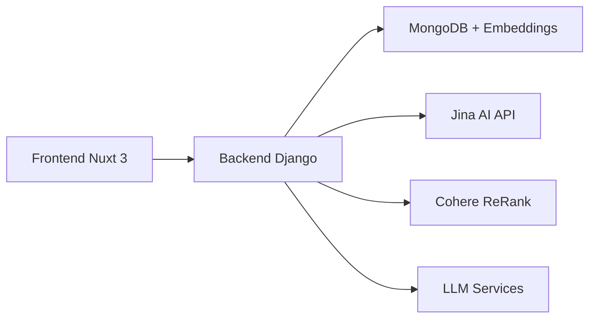

# 🎯 Portfolio con Chat AI basado en MongoDB

> **Portafolio profesional con funcionalidades de chat AI avanzadas**

Este proyecto es un portafolio profesional moderno construido con **Nuxt 3** que integra servicios de inteligencia artificial especializados. La aplicación frontend se conecta a un backend privado con MongoDB para búsqueda semántica y RAG (Retrieval-Augmented Generation).

## ✨ Características Principales

- 🤖 **Chat AI Especializado**: Servicios de IA para ciberseguridad e IA generativa
- 🔍 **Búsqueda Semántica**: Sistema RAG con embeddings vectoriales
- 🌐 **Multilingüe**: Soporte completo para español, inglés y portugués  
- 🎨 **Interfaz Moderna**: UI responsiva con Nuxt UI y Tailwind CSS
- 🔒 **Autenticación JWT**: Sesiones seguras con tokens persistentes
- ⚡ **Optimizado para Producción**: Build optimizado con headers de seguridad

## 🤖 Servicios de IA Disponibles

| Servicio | Descripción | Especialización |
|----------|-------------|-----------------|
| 🛡️ **Experto en Ciberseguridad** | Asesoramiento especializado en seguridad informática | Pentesting, vulnerabilidades, hardening |
| 🧠 **Experto en IA Generativa** | Información sobre modelos de lenguaje y tecnologías de IA | LLMs, embeddings, RAG, frameworks |
| 🔄 **Agente RAG Unificado** | Sistema que combina búsqueda semántica y generación | Acceso a todos los documentos |

## 🏗️ Arquitectura



## 🚀 Inicio Rápido

### Prerrequisitos

- Node.js 18+
- npm/yarn/pnpm/bun

### Instalación

```bash
# Clona el repositorio
git clone https://github.com/miguelmurga/refactored-portfolio.git
cd refactored-portfolio

# Instala dependencias
npm install
# o
yarn install
```

### Configuración

1. **Copia el archivo de configuración:**
   ```bash
   cp .env.example .env.local
   ```

2. **Configura las variables de entorno:**
   ```env
   # Backend API URL - contacta al propietario para acceso
   NUXT_API_URL=https://tu-backend-url.com/api
   
   # Variables de desarrollo
   NODE_ENV=development
   NUXT_DEV_MODE=true
   ```

### Desarrollo

```bash
# Inicia el servidor de desarrollo
npm run dev

# La aplicación estará disponible en http://localhost:3000
```

## 🔐 Acceso al Backend

> **⚠️ IMPORTANTE**: Este repositorio contiene **solo el frontend**. El backend es privado y requiere autorización.

### Para Desarrolladores

Si necesitas acceso al backend completo para desarrollo:

1. **Contacta al propietario del repositorio** para solicitar acceso
2. Proporciona información sobre:
   - Propósito del acceso (desarrollo, investigación, colaboración)
   - Tu experiencia técnica relevante
   - GitHub username para invitación al repositorio privado

### Para Usuarios Finales

La aplicación está diseñada para funcionar con el backend en producción:

- ✅ **Frontend público**: Interfaz de usuario disponible
- 🔒 **Backend privado**: API y base de datos protegidas
- 📧 **Soporte**: Contacta para consultas o colaboraciones

## 🛠️ Scripts Disponibles

```bash
# Desarrollo
npm run dev                 # Servidor de desarrollo
npm run build              # Build de producción  
npm run build:prod         # Build optimizado para producción
npm run preview            # Preview del build

# Producción
npm run start              # Servidor de producción
npm run start:prod         # Servidor optimizado para producción

# Utilidades
npm run typecheck          # Verificación de tipos TypeScript
```

## 📁 Estructura del Proyecto

```
refactored-portfolio/
├── components/            # Componentes Vue reutilizables
│   ├── chat/             # Componentes del sistema de chat
│   ├── global/           # Componentes globales
│   └── ui/               # Componentes de interfaz
├── composables/          # Composables de Vue
├── pages/                # Páginas de la aplicación
├── stores/               # Estado global (Pinia)
├── utils/                # Utilidades y helpers
├── locales/              # Archivos de internacionalización
└── public/               # Assets estáticos
```

## 🌐 Páginas Disponibles

| Ruta | Descripción |
|------|-------------|
| `/` | Página principal del portafolio |
| `/chat` | Interfaz principal de chat AI |
| `/chat/[id]` | Conversación específica |
| `/projects` | Galería de proyectos |
| `/aboutMe` | Información personal |
| `/contactMe` | Formulario de contacto |
| `/system-status` | Estado del sistema y APIs |

## 🔧 Tecnologías

### Frontend
- **Framework**: Nuxt 3, Vue 3, TypeScript
- **Estilos**: Tailwind CSS, Nuxt UI
- **Estado**: Pinia
- **Internacionalización**: @nuxtjs/i18n

### Backend (Privado)
- **API**: Django REST Framework
- **Base de Datos**: MongoDB
- **Embeddings**: Jina AI
- **ReRanking**: Cohere
- **LLM**: DeepSeek, OpenAI

## 🚢 Despliegue

### Build para Producción

```bash
# Build optimizado
npm run build:prod

# Generar sitio estático
npm run generate:prod
```

### Variables de Entorno de Producción

```env
# Configuración de producción
NODE_ENV=production
NUXT_DEV_MODE=false
NUXT_DEBUG_LOGS=false

# URL del backend en producción
NUXT_API_URL=https://api.tudominio.com/api
```

## 📄 Documentación Adicional

- 📖 [Estrategia de Ramas](./BRANCHING_STRATEGY.md)
- 🚀 [Guía de Despliegue](./DEPLOYMENT.md)
- 🐛 [Historial de Debugging](./CLAUDE_DEBUGGING_HISTORY.md)

## 🤝 Contribuciones

Las contribuciones son bienvenidas. Para cambios importantes:

1. Fork el repositorio
2. Crea una rama feature (`git checkout -b feature/nueva-funcionalidad`)
3. Commit tus cambios (`git commit -m 'feat: añadir nueva funcionalidad'`)
4. Push a la rama (`git push origin feature/nueva-funcionalidad`)
5. Abre un Pull Request

## 📞 Contacto

- **GitHub**: [@miguelmurga](https://github.com/miguelmurga)
- **LinkedIn**: [Miguel Murga](https://linkedin.com/in/miguelmurga)

## 📝 Licencia

Este proyecto está bajo la Licencia MIT. Ver el archivo `LICENSE` para más detalles.

---

**🛡️ Nota de Seguridad**: Este repositorio es público pero el backend es privado por razones de seguridad. No expone APIs keys, secrets, o datos sensibles.
