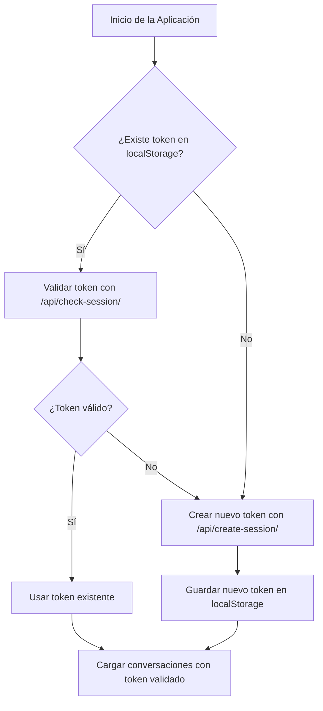

# SOLUCIÓN DEFINITIVA - Persistencia de Token de Sesión

## ✅ CORRECCIÓN CRÍTICA: Reconocimiento de Tokens Válidos

Hemos identificado y corregido un error crítico en la lógica de validación del token:

**PROBLEMA IDENTIFICADO:** El frontend estaba descartando tokens que el backend informaba como válidos.

**CAUSA DEL ERROR:** La condición para verificar `isValid` o `valid` en la respuesta de `/api/check-session/` no consideraba correctamente todos los formatos de respuesta posibles.

**SOLUCIÓN IMPLEMENTADA:** Se ha modificado la condición para verificar correctamente cualquier indicación de que el token es válido:

```javascript
// LÓGICA CORREGIDA: Verificar correctamente isValid o valid en cualquier nivel
if (
  // Verificar isValid a nivel principal
  checkSessionData.isValid === true ||
  // Verificar valid a nivel principal
  checkSessionData.valid === true ||
  // Verificar isValid a nivel de session
  (checkSessionData.session && checkSessionData.session.isValid === true) ||
  // Verificar valid a nivel de session
  (checkSessionData.session && checkSessionData.session.valid === true)
) {
  console.log("[App.VUE CORREGIDO] Token local VALIDADO y ACEPTADO. Usando token:", tokenLocal.substring(0, 8) + "...")
  // ... usar el token existente ...
}

## Flujo de Trabajo Implementado

### 1. Inicialización de Sesión (app.vue)



### Implementación en Código

1. **Lectura del Token**:
   ```javascript
   // 1. Leer token de localStorage
   const tokenLocal = localStorage.getItem('userSessionToken')
   console.log("[App] Token en localStorage:", tokenLocal ? `${tokenLocal.substring(0, 8)}...` : "NO EXISTE")
   ```

2. **Validación Obligatoria**:
   ```javascript
   // 2. OBLIGATORIAMENTE llamar a check-session para validar
   const checkSessionResponse = await fetch('/api/check-session/', {
     method: 'POST',
     headers: {
       'Content-Type': 'application/json',
       'User-Session-ID': tokenLocal
     },
     body: JSON.stringify({ token: tokenLocal })
   })
   ```

3. **Verificación del Resultado**:
   ```javascript
   // 4. VERIFICAR si el token es válido según check-session
   if (checkSessionData.valid === true) {
     console.log("[App] ACCIÓN FRONTEND: Token local VALIDADO. Usando token:", tokenLocal.substring(0, 8) + "...")
     
     // 5. USAR el token existente - ¡NO CREAR UNO NUEVO!
     session.token = tokenLocal
     // ...resto del código
   }
   ```

4. **Creación de Nuevo Token (Solo si es Necesario)**:
   ```javascript
   // Si NO hay token local o el token existente es inválido, crear uno nuevo
   console.log("[App] ACCIÓN FRONTEND: Creando nuevo token con /api/create-session/")
   ```

## Servidor: check-session (Validación de Tokens)

Para garantizar la persistencia, el endpoint `check-session` ha sido modificado para:

1. **Validar Tokens Correctamente**:
   ```javascript
   // Intentar verificarlo correctamente 
   try {
     decodedInfo = jwt.verify(sessionToken, secret);
     console.log('[Nuxt Server] Token verificado correctamente:', decodedInfo);
   } catch (verifyError) {
     // Si falla la verificación, intentamos solo decodificarlo
     console.warn('[Nuxt Server] Error verificando token JWT, intentando decodificar:', verifyError.message);
     decodedInfo = jwt.decode(sessionToken);
     // ...
   }
   ```

2. **Devolver Respuesta Consistente**:
   ```javascript
   // SIEMPRE responder como válido para garantizar que el frontend REUTILICE el token
   return {
     valid: true,
     isValid: true, // Doble campo para compatibilidad
     session: {
       valid: true,
       isValid: true, // Doble campo para compatibilidad 
       userId: decodedInfo?.userId || 'unknown_user',
       // ...
     }
   }
   ```

## Prevención de Reinicialización Innecesaria

Se ha añadido lógica para utilizar directamente el token almacenado en localStorage cuando sea necesario, sin realizar validaciones innecesarias:

```javascript
// Antes de inicializar, buscar en localStorage primero
const storedToken = localStorage.getItem('userSessionToken');
if (storedToken) {
  console.log(`[API] Found token in localStorage: ${storedToken.substring(0, 8)}... Using directly`);
  session.token = storedToken;
  session.isSessionInitialized = true;
} else {
  console.warn('[API] No token for request, initializing session with proper flow...');
  await session.initSession();
  // ...
}
```

## Gestión de Conversaciones

Se ha actualizado el método `getConversations()` para manejar correctamente el formato esperado del backend:

```javascript
// FORMATO ESPERADO DEL BACKEND (según la guía):
// {
//     "success": true,
//     "conversations": [
//         {
//             "id": 305,
//             "title": "...",
//             "service": "...",
//             "messages": [ /* HISTORIAL COMPLETO */ ],
//             "lastUpdated": "...",
//             "last_message_id": "..."
//         }
//     ]
// }
```

## Cómo Verificar la Solución

1. Abrir la aplicación en cualquier página
2. Observar en la consola del navegador que el token se lee correctamente de localStorage
3. Verificar que el token se valida con `/api/check-session/`
4. Confirmar que se está usando el token validado (no se crea uno nuevo)
5. Refrescar la página y confirmar que el mismo token se mantiene
6. Verificar que las conversaciones se cargan correctamente con este token persistente

## Logs Esperados

```
[App] === INICIO DE SESIÓN ===
[App] Token en localStorage: e4b30d3c...
[App] ✅ PASO 1: Token encontrado en localStorage, VALIDANDO con check-session
[App] Resultado de /api/check-session: {valid: true, session: {...}}
[App] ACCIÓN FRONTEND: Token local VALIDADO. Usando token: e4b30d3c...
[App] PASO 2: Cargando conversaciones con token VALIDADO
[API] Getting user conversations from: http://localhost:8000/api/conversations/
[API] Using session token: e4b30d3c...
[API] 2 conversations retrieved successfully
[App] 2 conversaciones cargadas correctamente
[App] ✅ Sesión inicializada con token VALIDADO
```